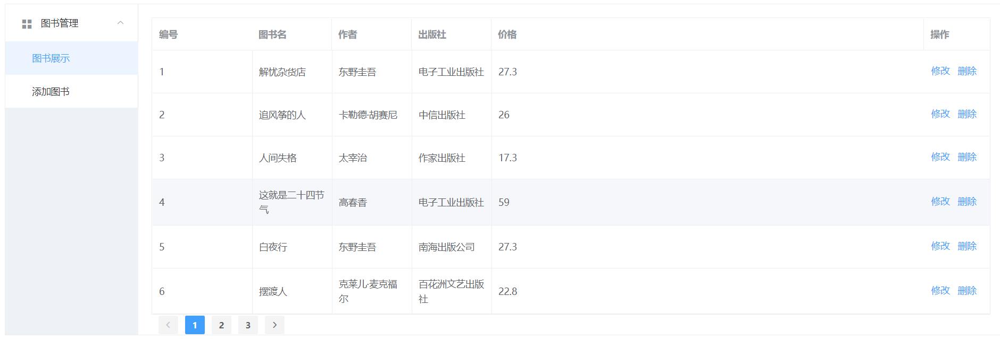
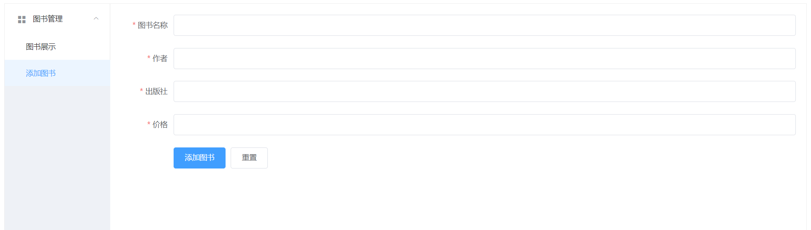
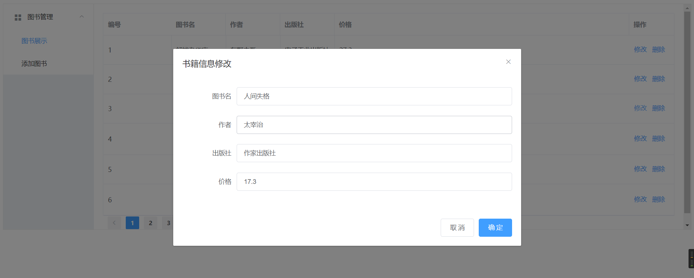
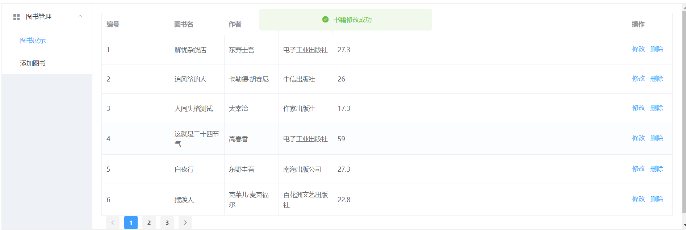

# 基于SpringBoot JPA Vue的一个小Demo

Vue文件夹为前端代码，SpringBoot-JPA为后端代码。

- 基于Vue脚手架@vue/cli 4.3.1，SpringBoot 2.2.6.RELEASE，JKD 1.8，Element-Ui。
- SpringBoot项目使用了Lombok插件，使用JPA操作数据库。

项目运行截图：













### **前端代码执行**：

## Project setup

```
npm install
```

### Compiles and hot-reloads for development
```
npm run serve
```

### Compiles and minifies for production
```
npm run build
```

### **后端代码导入IDEA启动运行即可**。


